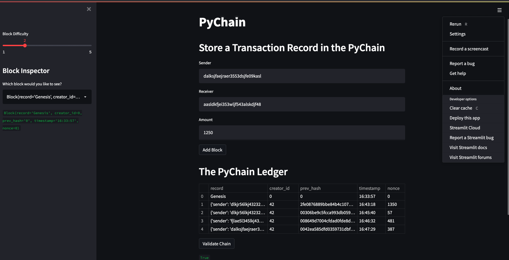

# PyChain Ledger

In this project I build a blockchain-based ledger system, complete with a user-friendly web interface, via Streamlit. In this scenario, the ledger would allow partner banks or FI entities to conduct financial transactions (that is, to transfer money between senders and receivers) and to verify the integrity of the data in the ledger.

I performed the following tasks within a Python file for this project:

1. Create a new data class named `Record`. This class will serve as the blueprint for the financial transaction records that the blocks of the ledger will store.

2. Create/Modify the `Block` data class to store `Record` data.

3. Add Relevant User Inputs to the Streamlit interface.

4. Test the PyChain Ledger by Storing Records.

---
## Files & Streamlit Documentation

[PyChain.py File](PyChain_Code/pychain.py)

Streamlit is an open source application framework in Python language. It allows Python developers to create web apps for data science and machine learning in a short time. Documentation link provided below:

[Streamlit Documentation](https://docs.streamlit.io/library/get-started)

---

## Test the PyChain Ledger by Storing Records

Tested the `PyChain` ledger and user interface by running the Streamlit application and storing some mined blocks in the `PyChain` ledger. Then tested the blockchain validation process by using the `PyChain` ledger. The following User Interface demonstrates the PyChain Ledger:

---

